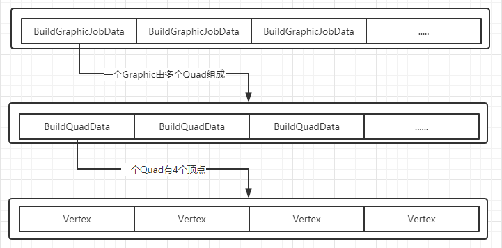

## OverView

Unity UGUI 当UI元素变换时总是伴随着大量的Rebuild及Layout行为，在实现HUD这样变化十分频繁的UI时显得不给力，战斗过程中容易产生卡顿，GC.Alloc。常规的UI优化中提到的动静分离也是尽可能减少UI元素变换时重建的消耗，UGUI中的是以Canvas为单位去动态维护的。为了解决这个问题，解决之道就是自定义Mesh去渲染HUD相关的元素，做针对性的优化。

## UGUI 实现HUD面临的问题

1. 效率：不断重建带来的消耗
2. 需要手动维护Canvas的Order，以确保不同角色间的HUD前后显示关系时正确的，多个canvas就是多个pass
3. 为了显示效果，文本还需要描边之类的效果

## 技术方案

采用自定义Mesh的方案，还是避免不了ReBuild的问题，只不过时自定义的实现，容易做针对性的优化。考虑到每个图片，文本的重建都是独立的，是可以并行的，自然而然的想到JobSystem去干这个事情，这样把最重的工作丢给Worker线程，主线程得以释放更多的耗时，配合数学库**Mathematics（SIMD）**和**Burst编译器**最大化效率。

所以，最后整体方案就是：JobSystem + Mathematics + Burst，每个人物的HUD使用一个Mesh绘制，由于是3D的HUD所以前后关系交给引擎就可以了，最后为了实现高效的描边，文本直接使用TextMeshPro的SDFAA动态字体方式，描边几乎是无消耗的。

More: 为了更好的渲染效率，单独编写一个Shader，同时用于文本和图片的渲染（所有用到的图打包到自定义的一张texture上），这样理论上整个HUD的绘制只需要一个Pass

## 实现

这个好像没有特别的地方，JobSystem 是Unity DTOS的一部分，关键在于设计好数据结构弄清如何方便的维护数据。

简单的数据结构展示：
3个数组，3个数组之间根据一个Graphic包含的Quad(矩形)的多少，有一个对应关系，通过记录索引，或者直接使用索引，计算出另外一个数组的数据范围。

真个流程分为3个步骤：

1. BuildGraphicJob：根据收集到的需要重建的Graphic进行顶点属性的计算，结果输出到Vertex中。

2. CollectionMeshJob:在BuildGraphicJob的下一帧进行，一个人物的头顶信息包含多个Graphic,g根据包含的Graphics，收集顶点，更新到Mesh上，这里有必要的化会对Graphic根据前后关系进行排序，保证mesh内遮挡关系正确。

3. MemoryAdjustJob: 根据Graphic的增删，调整3个数组的内存，使其保持连续。

## 后记

最终的效果非常不错，无GC.alloc, 主线程耗时低，Burst编译器也给力。在实际实装的时候还有一些细节，如Layout布局的支持，通过代码设计尽可能减少Graphic重建的必要，TextAsset纹理没有空间之后的处理，预制编辑工作流的编辑工具实现等等。